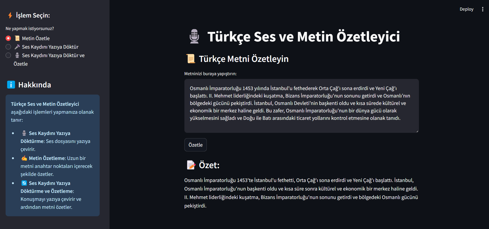
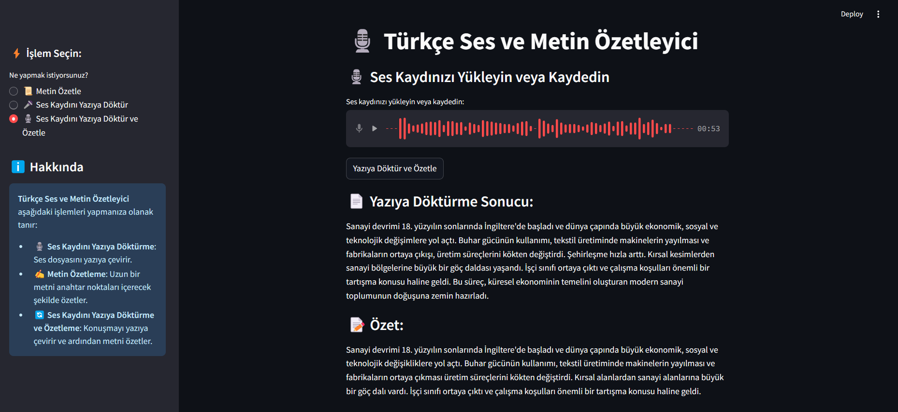

# Turkish Audio & Text Summarizer

🚀 **A powerful tool to transcribe and summarize Turkish audio and text using state-of-the-art AI models.**

## 📌 Features

- 🎧 **Transcribe**: Convert speech to text from an uploaded audio file.
- ✍️ **Summarize**: Extract key points from Turkish text input.
- 🔄 **Transcribe & Summarize**: Convert speech to text and then generate a summary.

## 📸 Screenshots

### 🎧 Transcription Page


### ✍️ Summarization Page


### 🔄 Transcribe & Summarize Page


## 🛠️ Technologies Used

- **FastAPI** (Backend API)
- **Streamlit** (Frontend UI)
- **Whisper** (Speech-to-Text)
- **Helsinki-NLP Models** (Turkish-English Translation)
- **BART** (Summarization Model)
- **PyTorch** (Machine Learning Framework)

## 🚀 Installation & Setup

### 🔹 Step 1: Clone the Repository
```
git clone https://github.com/your-username/turkish-audio-summarizer.git
cd turkish-audio-summarizer
```
### 🔹 Step 1: Clone the Repository
```
git clone https://github.com/your-username/turkish-audio-summarizer.git
cd turkish-audio-summarizer
```
### 🔹 Step 2: Create a Virtual Environment
```
python -m venv venv
source venv/bin/activate  # On macOS/Linux
venv\Scripts\activate  # On Windows
```
### 🔹 Step 3: Install Dependencies
```
pip install -r requirements.txt
```
### 🔹 Step 4: Run the Backend API (FastAPI)
```
uvicorn main:app --reload
```
### 🔹 Step 5: Run the Frontend (Streamlit)
```
streamlit run ui.py
```
